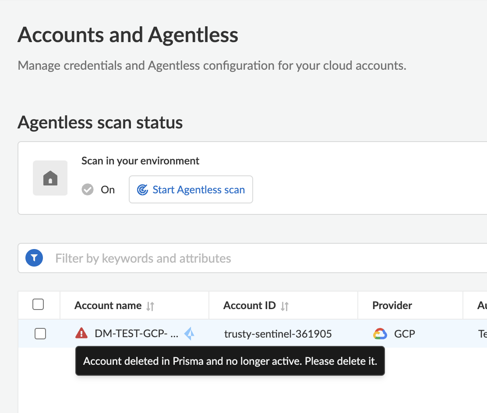

# prisma-cloud-cwp-bulk-deletion

## Description

Script for bulk deletion of inactive and orphan accounts in Prisma Cloud CWP (Runtime Security)

Example below :



## Installation

Create a python virtual environment, activate the environment and install the required packages

```
python3 -m venv env
source env/bin/activate
pip install -r requirements.txt
```
## Prerequisite

Create an Access Key on Prisma Cloud, you can refer to the [online documentation](https://docs.prismacloud.io/en/enterprise-edition/content-collections/administration/create-access-keys)

As this is an administrative action, the role of the user or Service Account associated with the Access Key must be [Sytem Admin](https://docs.prismacloud.io/en/classic/cspm-admin-guide/manage-prisma-cloud-administrators/prisma-cloud-administrator-roles).


## Configuration

Create or update credentials and the Prisma Cloud stack configuration file`.prismacloud/credentials.json`  Below is the syntax of the file:

```json
{
    "identity": "<PC_ACCESS_KEY>",
    "secret": "<PC_SECRET_KEY>",
    "api_stack": "<PC_API, exemple: api0>", 
    "ca_cert": ""
}
```

`ca_cert` is needed to eliminate some warning messages while using global protect or other VPN services.  To create the ca_cert file you can user the following script: https://github.com/PaloAltoNetworks/prismacloud-api-python/blob/main/scripts/pcs_ssl_configure.py

`api_stack` should match the [stack you are connecting](https://pan.dev/prisma-cloud/api/cspm/api-urls/) to `api,api0,api2,api3,api4,api.eu,api2.eu,api.fr, etc...`

`identity` is the Prisma Cloud access key

`secret` is the Prisma Cloud secret key

<u>Example credentials.json :</u>

```json
{
    "identity": "d7b31941-XXXXX-XXXX-YYYYY-ZZZZZZZZ",
    "secret": "BydXXXXXXXXXXXXXXXXXXX",
    "app_stack": "api2.eu", 
    "ca_cert": ""
}
```

## Executing Script

Go to bulk folder and run script 

```
cd bulk
python3 cwp-bulk-purge.py -x credentials.json -c
```

 * `-h` for help

 * `-x` to specify the name of the authentication file in the `~/.prismacloud` directory. For example `-x credentials.json`. The path is hard-coded so just specify the file name.

 * `-c` most of the scripts will build a local cache file and this option will trigger that action. On subsequent calls of the script the `-c` options may not be needed, as the data you are acting on is stored locally. 

 * `-f` will identify the cache file.  Most scripts have a default file, but this option will give you the flexibility to change the file name. 

   

### Credits

Based on the work of Stephen Gordon
